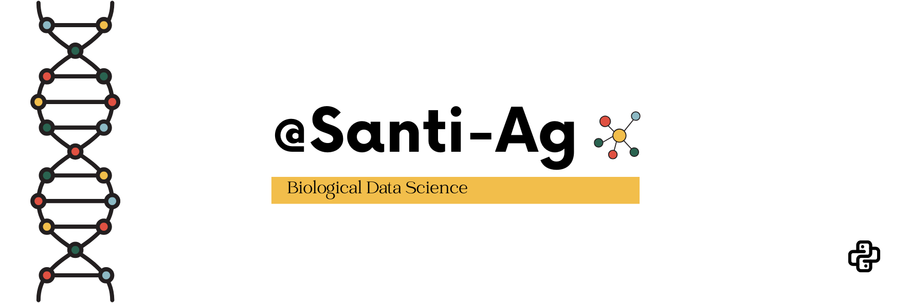

  <h1 align="center">Hola 🧬👋</h1>

  

---

### 🌐 Encuéntrame en:

---

### 📊 About me
- 👨‍🔬 Biological Engineer with an interest in bioinformatics and data analysis.
- 💻 Experience with R, Python, and data visualization.
- 📈 I enjoy transforming data into clear, visual information.
